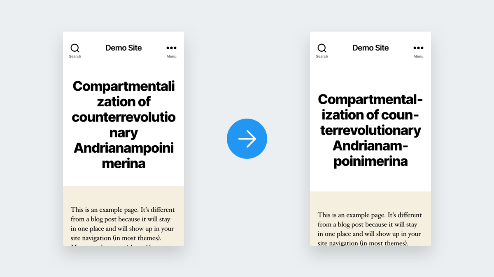

# Syllable Hyphenator

[](https://github.com/joppuyo/syllable-hyphenator/actions)



Server-side hyphenation for WordPress with [Syllable](https://github.com/vanderlee/phpSyllable) library. It works by inserting `&shy;` or "soft hyphen" characters to your strings so browsers will hyphenate the words correctly for you.

## Compatiblity

- PHP 7 +
- WordPress 5.0 +
- (Optional) Timber 1.10.0 +
- (Optional) Polylang

## Installation

1. Download latest version on the [Releases](https://github.com/joppuyo/syllable-hyphenator/releases) page.
2. Upload plugin on the WordPress plugin admin page.
3. Activate plugin.
4. See section below on how to use the plugin in your theme

## Usage

You can use the `hyphenate` WordPress filter to hyphenate text.

```php
echo '<h1>' . apply_filters('hyphenate', get_the_title($post)) . '</h1>';
```

If you are using [Timber](https://www.upstatement.com/timber/), you can also use the `hyphenate` Twig filter,

```twig
<h1>{{ post.title | hyphenate }}</h1>
```

## Filters

### Minimum word length

`syllable_hyphenator_min_word_length`

By default, minimum word length for hyphenation is set to 12 characters. This prevents awkward hyphenation of very short words.

```php
add_filter('syllable_hyphenator_min_word_length', function () {
  return 6;
});
```

### WordPress locale

`syllable_hyphenator_wp_locale`

Language used for hyphenation. By default this is the language specified in the WordPress settings page. This can be overridden using this filter. The locale should be in WordPress locale format, for example `en_US`.

```php
add_filter('syllable_hyphenator_wp_locale', function () {
  return 'en_US';
});
```

### Current language

`syllable_hyphenator_current_locale`

This overrides the WordPress language. This is useful if you have different language content on your site. If Polylang is installed, the current Polylang post language will be used. Return value should be in Syllable library format, for example `en-us`.

```php
add_filter('syllable_hyphenator_current_locale', function () {
  return 'en-us';
});
```
